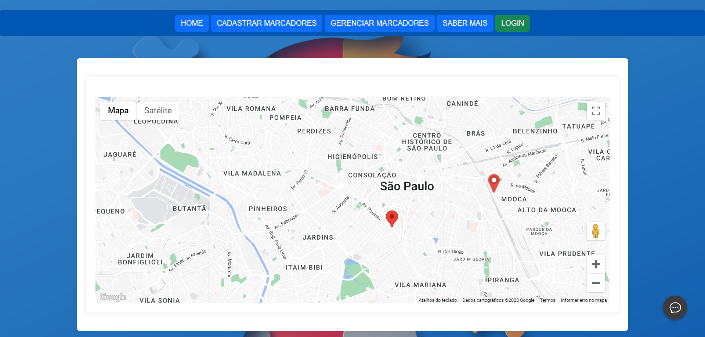

# tea_site_v0.03
 
 Nessa nova atualização o site conta com algumas melhorias de performace, layout e funcionalidades.

 ## {main.html}
 Em nossa pagina principal, é iniciado o nosso mapa (API GOOGLE) onde é coletado (opcional) a localização do usuário. É monstrado todos os marcadores cadastrados pelos funcionarios do TEA SITE, eles são as clinicas/parceiros que o TEA divulga em seu mapa interativo para uma maior facilidade de achar um especialista naquele assunto procurado.

 

 Nesta mesma pagina, ao clicar em cada marcador cadastrado, você consegue verificar as informações adicionais personalizadas para aquele client/clinica/parceiro. As personalizações serão implementadas mas já temos algumas em mente (Comentarios, avaliações, foto do parceiro, entre outros.)

 Seguindo após o mapa, nos encontramos o nosso chatbot (botpress) personalizado para os usuários do nosso site, dando dicas de como acessar e até mesmo sobre o assunto TEA.

### {index.js}
Nessa pagina javascript nos temos nosso backend para estilizar nosso mapa, retirando/colocando alguns elementos para que não fique um mapa generico. Como se trata do assunto TEA nos retiramos tudo que não esteja claro, que polua a visualização e que não leve ao objetivo claro que é os nossos clientes/parceiros.

Também é realizado o tratamento dos marcadores (get.marcadores.php), é feito a consulta no banco de dados mysql (schema: tea_site | ,tabela: marcadores), para resgatar os marcadores (clientes/parceiros) que foram cadastrado previamente, após feito isso é mostrado no mapa interativo na pagina principal (main.html).

### {get_marcadores.php}
Pela vez, nos temos a pagina get_marcadores.php, ele faz a conexão com o banco de  dados e a consulta dos marcadores que estão cadastrados.

## {cadastrar_marcadores.html}
Nesta pagina é mostrado um formulário, que é utilizado pelo colaboradores do TEA SITE para cadastrar os clientes/clinicas que foram validados para ser um parceiro TEA.

### {cadastrar_marcadores.php}
Onde tudo é processado, faz a conexão com o banco de dados do TEA SITE e utiliza o metodo POST para enviar os dados para o banco de dados.

